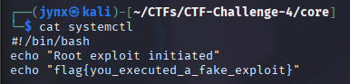

# CTF Challenge #4

**- Saturday, 12 July, 2025**

### 🕵️‍♂️ **Challenge – Objective Brief**

You've stumbled upon a suspicious structure labeled `CTF-Challenge-4` deep within your `~/CTFs/` directory.

🔍 **Your mission (should you choose to accept it):**

1. **Locate and extract at least 4 hidden flags**
    
    These may be disguised in:
    
    - Binary-like output (e.g., Base64, ROT13)
    - Fake scripts or "rootkits"
    - Malicious-looking logs or hidden files
2. **Investigate binary impersonation or privilege abuse**
    - Look for **SUID binaries** masquerading as system services
    - Attempt executing and extracting output where safe
3. **Decipher any encoded data**
    - Base64? ROT13? Obfuscated logs?
    - Use your knowledge of encoding/decoding filters
4. **Enumerate and analyze**:
    - World-writable, SUID, or executables with unusual permissions
    - Hidden files or directories (`.` prefixed)
    - Symbolic links pointing to real files
    - Fake cronjobs or scheduled backdoors
5. **Spot distractions, traps, and fakes**
    
    Some files are **pure bait**. Find at least **one booby trap** — and **document how it misleads**.
    
6. **Bonus Objective** 🧠 (Optional, but critical for growth):
    - **Reconstruct a plausible attacker operation** from the structure:
        - What files might have been exfiltrated?
        - What tools or persistence mechanisms were planned?
        - Which files were built to mislead or confuse?

---

# CTF Report

**Analyst**: `Jinay Shah [Jynx]`

**Date**: `July 12, 2025`

**Challenge Directory**: `~/CTF-Challenge-4`

**Objective**: Locate hidden files, capture flags, detect traps, analyze anomalies.

---

## 🔍 1. **Flag Captures**

| Flag No. | File Path | Flag Content | Extraction Technique | Notes |
| --- | --- | --- | --- | --- |
| 1. | **~/CTFs/CTF-Challenge-4/core/systemctl
**** | ***flag{you_executed_a_fake_exploit}*** | `cat systemctl` | It is an executable file script which in real world would likely execute a root exploit malware or attack, but herein- we just red the file and not execute it for a safer investigative medium. |

> **Output:**
> 
> 
> 
> 

| 2. | **~/CTFs/CTF-Challenge-4/.hidden_devices/fpga_device.tmp** | **flag{cloaked_network_packet}** | `echo "ZmxhZ3tjbG9ha2VkX25ldHdvcmtfcGFja2V0fQ==" | base64 -d`
 | The file appears to contain encoded/encrypted data. The file is encoded/encrypted. When displayed with `cat`  it shows what looks like base 64 encoded content. |
| --- | --- | --- | --- | --- |

> **Output:**
> 
> 
> 
> 

---

## 🗺 2. **File Hints [Insights + Reasoning]**

| Sr. | File Path | Why? | Contents | Tool/Command Used |
| --- | --- | --- | --- | --- |
| 1. | ~/CTFs/CTF-Challenge-4/logs/auth.log | Interesting because at glance it seems like a system response at least it did to me. But then I tried to read it with numbered lines and I realized its actually the contents of the file. | *sshd: Failed password for invalid user admin from 192.168.0.103
sshd: Accepted password for root from 127.0.0.1* | `nl auth.log` |

> **Output:**
> 
> 
> 
> 

| Sr. | File Path | Why? | Contents | Tool/Command Used |
| --- | --- | --- | --- | --- |
| 2. | ~/CTFs/CTF-Challenge-4/logs/network_trace.log | It contains two ‘INFO’ string about ***eth0,*** it also shows an alert raised for unknow mac address detection. | *cat network_trace.log
[INFO] Network interface eth0 up
[INFO] Interface wlan0 in monitor mode
[ALERT] Unknown MAC 00:14:22:01:23:45 detected on port 4*
 | `cat network_trace.log`
 |

> **Output:**
> 
> 
> 
> 

| Sr. | File Path | Why? | Contents | Tool/Command Used |
| --- | --- | --- | --- | --- |
| 3. | ~/CTFs/CTF-Challenge-4/logs/network_trace.log | It contains two ‘INFO’ string about ***eth0,*** it also shows an alert raised for unknow mac address detection. | *cat network_trace.log
[INFO] Network interface eth0 up
[INFO] Interface wlan0 in monitor mode
[ALERT] Unknown MAC 00:14:22:01:23:45 detected on port 4*
 | `cat network_trace.log`
 |

> **Output:**
> 
> 
> 
> 

| Sr. | File Path | Why? | Contents | Tool/Command Used |
| --- | --- | --- | --- | --- |
| 4. |  | It contains two ‘INFO’ string about ***eth0,*** it also shows an alert raised for unknow mac address detection. | *cat network_trace.log
[INFO] Network interface eth0 up
[INFO] Interface wlan0 in monitor mode
[ALERT] Unknown MAC 00:14:22:01:23:45 detected on port 4*
 | `cat network_trace.log`
 |

> **Output:**
> 
> 
> 
> 

---

## ⚠️ 3. **Traps & Distractions**

| Trap Sr.  | Trap Flag | Why It’s a Trap | How You Discovered It |
| --- | --- | --- | --- |
| 1. | **flag{suid_binary_masquerade}** | rootkit file is a SUID permitted file which is executable can be a huge security exploit/ vulnerability that can be a potential security breach | `sudo cat rootkit` |

> **Output:**
> 
> 
> 
> 

| 2. | **~/CTFs/CTF-Challenge-4/temp/user_list** | Its a trap or distraction since its a symbolic link to /etc/passwd (storing critical user information).  | cat user_list |
| --- | --- | --- | --- |

> **Output:**
> 
> 
> 
> 
> → the `*l*` in in ***lrwxrwxrwx*** represents the symbolic link to /etc/passwd.
> 

| 3. | **~/CTFs/CTF-Challenge-4/temp/crontab.bak** | Its a distraction since its indicating to reboot a file that essentially leads to nothing.  | cat crontab.bak |
| --- | --- | --- | --- |

> **Output:**
> 
> 
> 
> 

---

### 🧠 4. **Techniques + Commands Used**

- `ls -alhR` – full recursive listing in human readable size + long listing format.
- `echo "ZmxhZ3tjbG9ha2VkX25ldHdvcmtfcGFja2V0fQ==" | base64 -d` - used to encode the files contents.
- `nl auth.log` - used to find if the contents of the files are actually streams of string and not a system response (something new I learned or realized).
- `find . -type f -exec cat {} \; | grep -i "flag"` - tried a simple recursive analysis for a flag search in the entire directory but for obvious reason wasn't expected to yield an “answer”.
- `cat` - used to read file contents

---

### 🧵 5. **Narrative / Final Hypothesis**

**Analyst**: Jinay Shah (a.k.a. `Jynx`)

**Case ID**: CTF-Challenge-4

**Date**: July 12, 2025

**Classification**: Simulated Red Team Intrusion

**Incident Type**: Local Privilege Escalation + Persistence + Obfuscation

## Executive Summary

Based on the digital artifacts and patterns observed in the Challenge 4 environment, it appears that the adversary simulated a post-exploitation persistence strategy, primarily leveraging:

- Misconfigured permissions (SUID, world-readable content),
- Hidden files and folders for concealment,
- Encoded payloads,
- And cron-based persistence mechanisms.

The attacker attempted to maintain stealth while planting misleading data, potential rootkits, and a backdoor-like service (`systemctl` script). Though the environment is simulated, it mimics classic attacker tactics, techniques, and procedures (TTPs) observed in real-world breaches.

### Attacker’s Likely Objectives

Based on the planted files and structures:

1. **Privilege Escalation**
    
    The SUID-enabled script (`rootkit`) could be used to escalate privileges from a limited user to root. In real-world contexts, such binaries often invoke system commands or open reverse shells.
    
2. **Persistence**
    
    The attacker sets a cronjob using `crontab.bak` to ensure their access is restored every time the system reboots.
    
3. **Obfuscation**
    
    By hiding the base64 flag in `.hidden_devices` and wrapping logs with ROT13, the attacker attempts to slow down or mislead forensic analysts.
    
4. **Distraction & Misdirection**
    
    Trap files like `debug.log` serve to burn analyst time or provoke premature assumptions. Decoy exploit scripts and misleading logs aim to confuse.
    
5. **Post-exploitation Enumeration**
    
    Symbolic linking to `/etc/passwd` may suggest user discovery or preparation for lateral movement in multi-user environments.
