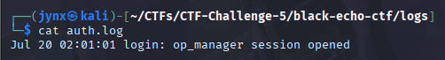

# CTF Challenge #5

# 🕵️‍♂️ **Operation Black Echo – Forensic CTF Write-up**

---

## 🧠 Executive Summary

**Short overview of the case and your final conclusion.**

- 📆 **Date Investigated**: **Tuesday 22 July, 2025**
- 🧑‍💻 **Analyst**: Jinay Shah *(a.k.a. **Jynx**)*
- 🎯 **CTF Goal**: Identify compromise path, exfiltrated data, persistence, and flag red herrings.

---

## 🧩 Case Timeline Reconstruction

> Key activities and how they unfolded chronologically (real or reconstructed).
> 

| Time | Event Description | Source File |
| --- | --- | --- |
| Jul 20, 2024 **02:01:01**  | login: op_manager session opened | `auth.log` |

| Time | Event Description | Source File |
| --- | --- | --- |
| Jul 20,2024 **02:02:02** | CRON[12345]: (op_manager) CMD (/usr/bin/python3 /tmp/.update.py) | `syslog` |

- **CRON[12345]**: Cron daemon with process ID 12345
- **(op_manager)**: User account running the job
- **CMD**: The command being executed
- **/usr/bin/python3 /tmp/.update.py**: A Python script in `/tmp/` (suspicious location)

### Why This is Suspicious

1. **Hidden file**: `.update.py` starts with a dot (hidden file)
2. **Temporary location**: `/tmp/` is an unusual place for legitimate system updates
3. **Generic name**: "update.py" is vague and could be malicious
4. **Automated execution**: Running via cron suggests persistence

| Time | Event Description | Source File |
| --- | --- | --- |
| July 20, 2024 02:02:12 | type=EXECVE msg=audit(1721460132.420:58): argc=3 a0="bash" a1="-c" a2="curl example.com" | `audit.log` |

The Unix timestamp `1721460132` converts to **July 20, 2024 at 02:02:12 UTC** - which is **10 seconds after** the cron job from the syslog!

Auditd Log Breakdown

- **type=EXECVE**: Records program execution
- **audit(1721460132.420:58)**: Timestamp (Unix epoch) and sequence number
- **argc=3**: 3 command line arguments
- **a0="bash"**: First argument - bash shell
- **a1="-c"**: Second argument - execute command flag
- **a2="curl example.com"**: Third argument - the actual command

### Potential Scenario

1. **2:01:01** - `op_manager` session opened (login/access gained)
2. **02:02:02** - Cron job runs `/tmp/.update.py`
3. **02:02:12** - Python script executes `curl example.com`

This timeline indicates:

**2:01:01** - Attacker gains access to the `op_manager` account

**~1 minute later** - Malicious cron job executes (possibly planted during the session)

**10 seconds after cron** - Outbound connection made

The `.update.py` script likely contains the curl command and is making an outbound connection - classic signs of:

- **Data exfiltration**
- **Command & Control (C2) communication**
- **Malware beacon activity**

---

## 🧪 Artifact Summary Table

> Quick overview of artifacts and how they contributed to your investigation.
> 

### File 1: Time Stamp Tampering

| Artifact Path | Relevance | Flag Discovered | Real or Red Herring |
| --- | --- | --- | --- |
| 1. `~/CTFs/CTF-Challenge-5/black-echo-ctf/README.txt`
2. `~/CTFs/CTF-Challenge-5/black-echo-ctf/evidence/resume.tar.gz`
3. `~/CTFs/CTF-Challenge-5/black-echo-ctf/evidence/USB_drive.img`
4. `~/CTFs/CTF-Challenge-5/black-echo-ctf/evidence/home/.bash_history`
5. `~/CTFs/CTF-Challenge-5/black-echo-ctf/evidence/home/legal_ops_notes.docx`
6. `~/CTFs/CTF-Challenge-5/black-echo-ctf/evidence/home/selfie.png` | 🕵️‍♂️ Medium
 | Time Stamp shows “2025” - **indicating system clock tampering.** The system time may have been *intentionally set forward* to obscure logs, create fake timestamps, or push cronjobs into a time window hard to trace. | ✅ Real |

### File 2: `resume.tar.gz`

| Artifact Path | Relevance | Flag Discovered | Real or Red Herring |
| --- | --- | --- | --- |
| `~/CTFs/CTF-Challenge-5/black-echo-ctf/evidence/resume.tar.gz` | 🤡 Low | Seems like a `.tar.gz` file, when I tried to unzip it is when I realized its not actually a zip file just pretending to be one. | ❌ Red Herring |

### File 3: `.bash_history`

| Artifact Path | Relevance | Flag Discovered | Real or Red Herring |
| --- | --- | --- | --- |
| `~/CTFs/CTF-Challenge-5/black-echo-ctf/evidence/home/.bash_history` | 🤡 Low | Contains some legitimate looking command line arguments but when mimicked it still hasn't reflected anything tangible value yet. | ❌ Red Herring |

### File 4: `selfie.png`

| Artifact Path | Relevance | Flag Discovered | Real or Red Herring |
| --- | --- | --- | --- |
| `~/CTFs/CTF-Challenge-5/black-echo-ctf/evidence/home/selfie.png` | 🤡 Low | Contains a ***FAKE PNG HEADER
EXIF: UUID-1A2B3C4D5E6F*** | ❌ Red Herring |

The EXIF UUID is invalid as well ***UUID-1A2B3C4D5E6F** -* for authenticity I cross checked it against multiple public portals.

---

## 💣 Red Herrings (False Leads)

- **`resume.tar.gz` -** Contains ***“FAKE TAR CONTENT”***
- **`legal_ops_notes.docx` -** Contains a **Decoy** Statement.
- **`exploit.py` - Red Herring Script,** although it did reveal one flag.
- selfie

---

## 🕸️ Persistence Mechanism Analysis

> Where did the attacker hide their access points?
> 

### File: `cleaner.sh`

→ This is a lab-protected and controlled environment, although its often observed in Real-world scenarios- files are executed in auto manner that often executed on triggers , when tried to read/execute (if) shell script(s) are planted at effective locations they can be executed without any extra effort or behavior to clear logs and clues/fingerprints that may have been left behind. Never try to execute a file to see its workings always read the contents in a safe and optimal manner with multiple copies to test and flag.
Although this one doesn't seem to have any tangible effect on the system since no files reside at the forth mentioned path in the snapshot. But can be presumed to be a post infiltration cleaning script/mechanism.
No persistence script found at path `/tmp/.update.py`, though its scheduled execution appears in `syslog`. It may have been deleted or planted as misdirection.

---

## 🎯 Flags Captured

| Objective | Flag |
| --- | --- |
| exploit.py | `flag{this_is_a_decoy}` |

---

## 🔚 **Conclusion & Strategic Takeaway**

Operation Black Echo emphasized the kind of adversary who doesn’t rely on complex malware, but on deception and subtlety — timestamp manipulation, harmless-looking cron jobs, and psychological misdirection through decoy files. This investigation sharpened my ability to correlate logs across layers, validate what’s actually there versus what’s simply referenced, and remain skeptical even when an artifact seems obvious.

Not every clue deserves to be chased — but every inconsistency demands to be explained. That was the core lesson. While a few artifacts remained ambiguous (like a referenced-but-missing backdoor), documenting that ambiguity truthfully became just as important as capturing flags. In the real world, attackers don’t always leave payloads behind — sometimes they leave questions.

This write-up reflects the reality of post-compromise investigation: scattered evidence, intentional noise, and the analyst’s job to thread it into a coherent, honest story — whether or not every answer is definitive.
