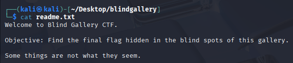

# CTF Challenge #6

# Operation: Blind Gallery

## **Objective:**

A disgruntled ex-employee of an art gallery is suspected of leaking confidential client records and auction details. All files found on their USB dump appear to be casual art resources—images, sketches, brochures. Yet something feels… off.

Your mission is to **identify what was exfiltrated**, **where it's hidden**, and **reveal the client list** if any.

---

## 📁 File Metadata

**Title:** Blind Gallery

**Date Attempted: Tuesday, 29 July, 2025**

**Type:** Steghide / Metadata / Red Herring

**Analyst**: Jinay *(a.k.a. **Jynx**)*

---

## 🛠️ Tools Used

→ **`exiftool`**

→ **`steghide`**

→ **`strings`**

→ **`stat`**

→ 

---

## 📄Initial Files

| File Name | Type | Size | Notes |
| --- | --- | --- | --- |
| **`readme.txt`** | TXT | 142 byes | Contains Introduction to the Challenge. |

| File Name | Type | Size | Notes |
| --- | --- | --- | --- |
| **`secret_hidden_file.txt`** | TXT | 56 bytes | Contains text and a direct indication to an assured **RED HERRING** file, decoy yet again. |

| File Name | Type | Size | Notes |
| --- | --- | --- | --- |
| **`log1.txt`** | TXT | 70 bytes | Contains text and a direct indication to an assured **RED HERRING** file- **`image3.jpg`**, instincts often don't lie no? |

| File Name | Type | Size | Notes |
| --- | --- | --- | --- |
| **`clue.xml`** | TXT | 70 bytes | Is a .txt file pretending to be .xml, am I gonna investigate it further? If I had the liberty of time maybe? Right now absolutely not- I did not find one hashed code or encrypted text worth hammering over. **DECOY**- Classic Red Herring. |

---

## 💾Analysis & Observations

| File Name | Type | Size | Notes |
| --- | --- | --- | --- |
| `image1.jpg` | JPG | 35 bytes | Its a decoy file apparently, although not trustable in a CTF context but sure ill let it pass- since its a **`.txt`**file disguised as **`.jpg`.** It is instinctive but I think it is indeed actually a decoy. |

| File Name | Type | Size | Notes |
| --- | --- | --- | --- |
| `image2.jpg` | TXT | 25 bytes | Its a decoy file apparently, **RED HERRING** OF SORTS- the file is named to pretend as a **`.jpg`** extension file but is actually a **`.txt`**file. |

| File Name | Type | Size | Notes |
| --- | --- | --- | --- |
| `image3.jpg` | TXT | 54 bytes | Same pattern `.jpg` file pretending to be a `.txt` file- there are no images/pixels to look at its trying to deceive- most apparent **RED HERRING** sequence of files. **CLASSIC**. |

---

## 🧩 Final Flag(s)

| File Name | PATH | Notes |
| --- | --- | --- |
| **fakeflag.txt** | `~/Desktop/blindgallery/decoys` | **`FLAG{not_this_one}`** |

| File Name | PATH | Notes |
| --- | --- | --- |
| **.flag.txt** | `~/Desktop/blindgallery/hidden` | **`FLAG{blind_gallery_flag_discovered}`** |

<aside>
💡

interesting how sometimes the exact directory lays out what to do **`ls -a`** [to see hidden files] directory is namely hidden or indication towards hidden file and the flag is right in sight but you might miss out for one simple option extended at the end.

</aside>

---
