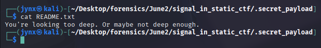

# CTF Challenge #7

# Operation: Signal in Static

## 📄**Background**

You are a digital forensics analyst brought in to investigate a suspicious image file anonymously posted to an underground forum used by a cybercrime syndicate. The image looks like a corrupted or distorted PNG file — random noise, no clear subject. But intelligence suggests it may carry a hidden message or payload.

A recently apprehended insider confessed that some members hide messages in *"static,"* while metadata or naming patterns help identify how to extract or decode the payload.

You have access to:

- 1 corrupted image (`noise_puzzle.png`)
- A suspicious audio fragment (`weird_signal.wav`)
- A `.txt` note (`readme.txt`)

---

## 🔎**Objectives**

1. **Perform metadata analysis** on all files. (Focus on inconsistencies, timestamps, tool history, and any fields that don’t match the context.)
2. **Determine the true nature of the PNG image** – Is it hiding data via stego, appended payload, or EXIF artifacts?
3. **Inspect the audio file** – Is it actually audio, or is it misnamed? Does it contain a DTMF pattern? Spectrogram clue?
4. **Correlate information** between the text note and the image/audio to derive a **single flag**.
5. **Extract the flag** and validate it using the hint mentioned in `readme.txt`.

---

## 🛠️ Tools Used

→ **`exiftool`**

→ **`xdg`**

→ **`steghide`**

→ **`strings`**

→ **`stat`**

→ **`file -i`**

→ **`xxd`**

→ **`hexdump`**

→ **`binwalk`**

---

## 📄Initial Files

| File Name | Type | Size | Notes |
| --- | --- | --- | --- |
| **`readme.txt`** | TXT | 142 byes | Contains a kind of *smiling challenge* thought in your face.
Personally I like it. |



---

## 💾Analysis & Observations

| File Name | Type | Size | Notes |
| --- | --- | --- | --- |
| **`surveil001.jpg`** | JPG | 27 bytes | Its a decoy file apparently, although not trustable in a CTF context but sure ill let it pass- since its a **`.txt`**file disguised as **`.jpg`.** It is instinctive I believe its a decoy a decoy. |


| File Name | Type | Size | Notes |
| --- | --- | --- | --- |
| **`note.txt`** | TXT | 89 bytes | Its a decoy file, meta-decoy of sorts hinting somewhere but also nowhere.  |


| File Name | Type | Size | Notes |
| --- | --- | --- | --- |
| **`scrambled.docx`** | TXT | 47 bytes | A decoy file again, classic meta-decoy file hinting in a direction as well as nowhere- instinctively its red herring as well, in my opinion.  |


| File Name | Type | Size | Notes |
| --- | --- | --- | --- |
| **`image.png`** | TXT | 11 bytes | Its a decoy file surely, its a **`.txt`**file disguised as **`.jpg`.** The contents as well as the meta data screams **DECOY.** |


---

## 🧩 Final Flag(s)

| File Name | Notes |
| --- | --- |
| **leak.log** | **`FLAG{ghost_in_the_log_file}`** |


Upon examining the `leak.log` file, nothing appeared unusual at first glance — a simple HTTP 404 log entry. However, a deeper inspection using `xxd` and `hexdump -C` revealed an unexpected and unusually **long tail of UTF-8 byte sequences** that didn’t correspond to printable ASCII. The recurring presence of bytes like `e280 8be2` and `e280 808c` suggested the use of **zero-width Unicode characters**, which are invisible in plain text but valid in UTF-8 streams. These characters — **Zero Width Space (`\u200B`) and Zero Width Non-Joiner (`\u200C`)** — are classic steganography vectors. Suspecting binary encoding, we hypothesized that `\u200B` and `\u200C` were being used to encode `0` and `1`. Based on that, the Python script was constructed to extract these characters, convert the resulting bitstream into ASCII, and finally retrieve the hidden flag.

**`decoder.py`** file used to uncover the flag

```python
# decoder.py
with open("leak.log", "r", encoding="utf-8") as f:
    content = f.read()

# Extract only ZWS and ZWNJ
bits = []
for c in content:
    if c == '\u200B':
        bits.append('0')
    elif c == '\u200C':
        bits.append('1')

# Rebuild bytes from bits
flag = ''.join([chr(int(''.join(bits[i:i+8]), 2))
for i in range(0, len(bits), 8)])
print("Decoded flag:", flag)
```


