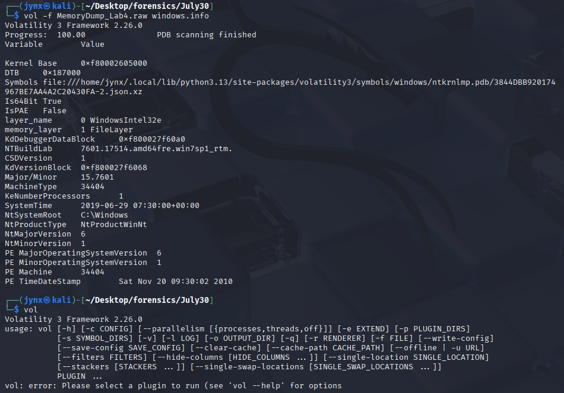

# LAB 4: OBSESSION

## 🧾 General Info

- **Challenge Name: Obsession: Shadows of the Deleted**
- **Memory Dump File Name: MemLabs-Lab4.7z**
- **Source / URL: [`*https://github.com/stuxnet999/MemLabs/tree/master/Lab 4*`](https://github.com/stuxnet999/MemLabs/tree/master/Lab%204)**
- **Date Started:** Wednesday **July 30**, 2025
- **Date Completed: N/A**
- **System Profile (from `windows.info`):** Windows 7 SP1 x64
- **Volatility Version Used:** Volatility 3 Framework - 2.26.0
- **Duration: N/A**
- **Challenge Description:**
    
    *“My system was recently compromised. The Hacker stole a lot of information but he also deleted a very important file of mine. I have no idea on how to recover it. The only evidence we have, at this point of time is this memory dump. Please help me.”*
    
    - **Note**: This challenge is composed of only **1** flag.
    - The flag format for this lab is: **`inctf{s0me_l33t_Str1ng}`**

---

## 🔍 Objective

> Clearly describe the goal of the challenge.
> 
> 
> *Example: “Find a deleted file named Important.txt that contains the flag.”*
> 

Lab 4 “Obsession” tests the analyst’s willingness to go beyond default outputs. It’s not about running a plugin — it’s about interpreting memory like a puzzle, obsessing over fragments of deleted data, and pushing every forensic tool to the limit. If you're not ready to dig deep, you won’t find the truth.

---

## 🛠️ Tools & Setup

| Tool | Version/Details |
| --- | --- |
| Volatility | **Volatility 3** [2.26.0] |
| OS | **Kali Linux** |
| Other Tools | **`Strings`
`grep`
`exiftool`
`stehide`** |



---

## 🧩 Phase 1: Image Info + Process Mapping

## 💾 1. `pslist`

→ The `pslist` plugin is one of the **most fundamental commands in memory forensics** using Volatility.

`pslist` enumerates **active processes** by scanning the **EPROCESS** structures in the memory dump. It's a way of peeking into the **process list the OS kept in memory when the snapshot was taken**.

### **Command**

```bash
vol -f MemoryDump_Lab4.raw windows.pslist
```

## Findings

### 1. High COUNT of Threads on **`svchost.exe`** [PID - 864]


- A typical **`svchost.exe`** instance runs **10–150 threads**, depending on the services it hosts.
- Having **900+ threads** in a single instance is not only unusual but likely points to:
    - **Malware injection**
    - **Process hollowing**
    - **Thread spraying** (evasion tactic)
    - **Rootkit or persistence technique**
    - Possibly **a memory exhaustion DoS vector**

### 2. Extremely Low **`dwm.exe`** **handles**


- Normally, `dwm.exe` [Desktop Windows Manager] spawns **once**, and holds **several hundred handles** and dozens of threads.
- We have **two instances**, **both with only 1 and 2 handles respectively**, and very low thread counts:
    - PID `1908`: 77 threads
    - PID `3000`: 76 threads

This is **highly atypical**, especially since they're spawned under the same parent (PID 840 `svchost.exe`) — even more suspicious because `svchost` is already a candidate for malware injection.

**SUSPICIOUS** because;

1. **TWO dwm.exe processes** (should only be one!)
2. **Handle counts too low** (76-77 vs expected 200-800+)
3. **Different sessions** (1 and 2)

**This Suggests:**

- **Process hollowing** (legitimate process replaced with malware)
- **Process impersonation** (malware pretending to be dwm.exe)
- **Possible rootkit activity**

This is **highly atypical**, especially since they're spawned under the same parent (PID 840 `svchost.exe`) — even more suspicious because `svchost` is already a candidate for malware injection.

## 2. ☠️ `malfind`

→ Volatility plugin that detects signs of code injection and malware in process memory by looking for suspicious memory regions with executable code.

**What it finds:**

- Injected code in processes
- Shellcode and malware
- Executable memory regions that seem suspicious etc.

### **Command:**

```bash
vol -f MemoryDump_Lab4.raw windows.malfind
```

## Findings:

### TEXTBOOK case of **malware injection** and process hollowing


All three processes have the **EXACT SAME** malicious code:

assembly

```bash
mov r10d, 0x80/0x81/0x82    ← System call numbers
movabs rax, 0x7fefe93a138   ← SAME address in all processes
jmp qword ptr [rax]         ← Jump to malicious code
nop                         ← Padding
```

### **Classic Injection Indicators:**

- **PAGE_EXECUTE_READWRITE** permissions (HUGE red flag!)
- **VadS** (Private memory allocation)
- **Same hex pattern**: `41 ba 80 00 00 00 48 b8 38 a1 93 fe fe 07 00 00`

### **Targeted Processes:**

- **`explorer.exe`** (PID 1944, 3012) - Windows Shell
- **`dllhost.exe`** (PID 2076) - COM + surrogate

### **What the attacker probably did:**

**Step 1: Process Hollowing**

- Injected malicious code into **legitimate processes**
- Replaced original code with **shellcode stubs**

**Step 2: System Call Hooking**

- `mov r10d, 0x80/0x81/0x82` → **System call numbers**
- `0x7fefe93a138` → **Shared malicious handler address**
- **Intercepts system calls** to hide activity

**Step 3: Persistence**

- Multiple processes → **redundancy**
- If one is killed, others continue

## 3. 📠 `cmdline`

Extracts and displays the command line arguments that were used to start each process, and exactly how each program was launched with what parameters and switches.

### **Command**

```bash
vol -f MemoryDump_Lab4.raw windows.cmdline
```

## Findings


```bash
2976    taskhost.exe    "taskhost.exe"                
1804    taskhost.exe    "taskhost.exe"         

# vs normal taskhost should look like:
taskhost.exe {243F5DED-C140-47D9-B005-B07948B2A976}
```

**→ `taskhost.exe` (PID 1804 and 2976) - Missing the `k` parameter pattern.**

- **Real taskhost.exe** manages scheduled tasks with **specific task GUIDs**
- **This one** just has `"taskhost.exe"` in quotes - **no actual task management!**
- It's **masquerading** as a legitimate Windows service

**Suspicions:**

1. **Two taskhost.exe processes** (unusual)
2. **No task GUIDs or parameters** (fake)
3. **Simple quoted executable name** (lazy impersonation)
4. **Different sessions** (1 and 2) but same behavior

**This suggests:**

- **Process impersonation** - malware pretending to be taskhost.exe
- **Lazy coding** - attacker didn't bother with realistic parameters
- **Multi-session persistence** - running in both user sessions

```bash
1944    explorer.exe    C:\Windows\Explorer.EXE         
2076    dllhost.exe     /Processid:{76D0CB12-7604-4048-B83C-1005C7DDC503}
2728    winlogon.exe    winlogon.exe                    
2976    taskhost.exe    "taskhost.exe"                  
3000    dwm.exe         "C:\Windows\system32\Dwm.exe"   
3012    explorer.exe    C:\Windows\Explorer.EXE         
```

### **The "`.EXE`" vs "`.exe`" Case Anomaly:**

**Windows is case-insensitive BUT;**

- **Real processes** typically show **consistent casing**
- **Registry entries** and **system calls** preserve original case
- **Malware** often has **different case patterns**

```bash
# Legitimate process creation preserves system casing
CreateProcess("C:\Windows\explorer.exe", ...)

# Malware might use different casing
CreateProcess("C:\Windows\Explorer.EXE", ...)  ← Hardcoded by attacker
```

### INSIGHTs:

The attacker got **lazy** or used an **automated tool** that doesn't properly mimic Windows process startup behavior. **Real Windows processes** have **rich command-line parameters**, while **malware processes** just have **basic executable paths**.

- **Real Windows processes** have **complex command-line arguments**
- **Malware** just uses **simple quoted paths** or **bare executable names**
- **No effort** to mimic legitimate process behavior

The attacker created **fake system processes** but didn't research how they **actually start**. They just copied the **executable names** without the **proper command-line arguments**.

**This is why the `-k` parameter is like a "digital fingerprint"** - it separates **real Windows processes** from **malware impersonation.**

It's a **fundamental Windows internals concept** that many attackers overlook.

## 4. 🧬 `dlllist`

→ Shows all the Dynamic Link Libraries (DLLs) loaded into each process's memory space - reveals what code libraries and functions each program is using.

```bash
vol -f MemoryDump_Lab4.raw windows.dlllist
```

## Findings


**Duplicate Explorer Process**

- One is **3012**, and the other explorer.exe was PID **1944**
- **Having multiple explorer.exe processes is highly unusual** and often indicates:
    - Process replacement/hollowing
    - Malware masquerading as explorer.exe
    - System instability or compromise

**Suspicious Timing Pattern**

- All DLLs load at exactly `2019-06-29 07:29:36.000000 UTC` initially
- This is **8 seconds after the dwm.exe** process we analyzed earlier
- Uniform timestamps across all initial DLLs suggest **batch loading** rather than organic process startup

**Missing VirtualBox Components**

- **Notable absence**: No `VBoxMRXNP.dll` like in the first explorer.exe (PID 1944)
- This suggests different execution contexts or potential masquerading

**Extensive Network/HTTP Components**
Additional network components not seen in first explorer:

- `WINHTTP.dll` - HTTP client functionality
- `webio.dll` - Web I/O operations
- Various wireless and network APIs loaded

**Delayed Fax Services Loading**

- Fax-related DLLs (`fxsst.dll`, `FXSAPI.dll`, `FXSRESM.DLL`) load at `07:29:47`
- **11-second delay** after initial loading - unusual for standard explorer

**HIGHLY SUSPICIOUS**: Multiple explorer.exe processes running simultaneously is a **major red flag**. This pattern commonly indicates:

1. **Process Hollowing**: Malware replacing legitimate explorer.exe
2. **Persistence Mechanism**: Malware maintaining presence via fake explorer
3. **System Compromise**: Unauthorized process execution


## 5. 🌐 `getsids`

→  Its **a plugin used in the Volatility framework for memory analysis, which prints the SIDs (Security Identifiers) owning each process.** SIDs are unique values used to identify a trustee, such as a user or group, and are crucial for understanding the privileges and identities of processes in a system's memory. 

### **Command:**

```bash
vol -f MemoryDump_Lab4.raw windows.getsids
```

### Findings:


**User Account Names**

- **"eminem" (RID 1000)** - This appears to be a non-standard administrative username, which is unusual for a typical corporate environment
- **"SlimShady" (RID 1001)** - This is clearly suspicious as it references Eminem's alter ego and suggests unauthorized account creation

**Privilege Escalation Indicators**

- The "eminem" user has **Administrator privileges** (S-1-5-32-544), which may indicate privilege escalation
- Both users are running multiple processes with interactive logon sessions

**Unusual Process Execution**

- **DumpIt.exe (PID 2624)** running under the "eminem" account with **High Mandatory Level** (S-1-16-12288) - This is a memory dumping tool, which could indicate:
    - Legitimate forensic analysis
    - Malicious memory extraction for credential harvesting
    - Anti-forensics attempts

**Multiple Active Sessions**

- Two separate user sessions are active simultaneously (eminem and SlimShady)
- This could indicate:
    - Session hijacking
    - Unauthorized concurrent access
    - Lateral movement between accounts

**Timing Concerns**

- The presence of GoogleCrashHandler processes suggests recent system activity
- StikyNot.exe (Sticky Notes) running under SlimShady account indicates active user interaction

---

## 🧩 Phase 2: FLAG FINDING

### **Command:**

```bash
vol -f MemoryDump_Lab4.raw windows.filescan > filescan.txt
```

## Findings:


The contents of the file **`filescan.txt`**


Found a couple of images since the challenge mentions on how a file was deleted and maybe we can find clues on it or plain decoys depending on further look here.

→ I failed to extract the contents of the actual file. Ill see what I can find further on from here.


sure lol,


Lets see if I can retrieve the contents of this Important.txt file or not- I hope I do lol its been hours now 🥲


Unfortunately, I cannot retrieve nor extract the Important.txt file- my challenge ends here for that matter why? Well try for yourself or watch the creator’s solution to know, I’d recommend tying it first but sure you wise enough to make your own decisions.

### Creator’s Solution Video:

[https://www.youtube.com/watch?v=R4ogPvN63Xg&list=PLwHfQPh43gyqJmZxGP2Pbys1g9d0_DHiy](https://www.youtube.com/watch?v=R4ogPvN63Xg&list=PLwHfQPh43gyqJmZxGP2Pbys1g9d0_DHiy)

---
